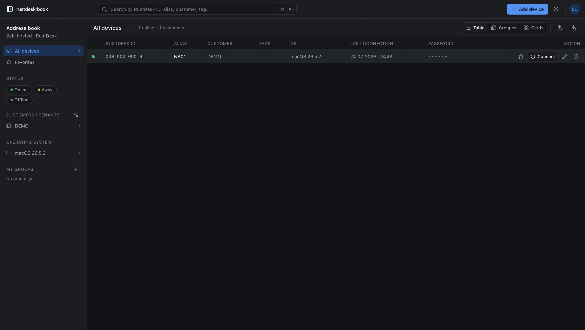

# rustdesk-book

A self-hosted address book for [RustDesk](https://rustdesk.com). It keeps
devices, credentials and customer assignments in one place — and starts a remote
session with a single click. Built for IT service providers and anyone
maintaining more than a handful of RustDesk IDs.

At its core it is a password vault: passwords are stored encrypted only, and
plaintext is revealed solely on an explicit, audited request. See
[SECURITY.md](./SECURITY.md).



## Features

- Devices with RustDesk ID, alias, customer, OS, tags and notes
- One-click connect via `rustdesk://` — the URI is built server-side with the
  password encoded correctly
- Passwords encrypted with AES-256-GCM; reveals and connects are audited
- Per-device connection history (who connected or revealed a password, and when)
- Customers as a first-class entity: rename once, applies to every device, with
  contact details and notes
- Personal favorites and private device groups per user
- Optional live status sync against your own RustDesk server
  (`RUSTDESK_API_URL`); without it the status stays manual
- Three views (table, grouped by customer, cards), full-text search and filters
  for status, OS, customer, tag, favorites and group
- JSON import/export (export excludes passwords)
- Roll out RustDesk OSS clients via Windows, Linux or macOS scripts; one-time or
  permanent enrollment tokens
- Invite-based sign-up; the first account becomes the administrator
- Light and dark mode
- Optional read-only MCP server: answer "do I have a device for customer X?"
  straight from your assistant

## Install

Requires Docker and Docker Compose.

```bash
git clone https://github.com/lucabmn/rustdesk-book.git
cd rustdesk-book
cp .env.example .env
```

Put these four values into `.env`:

```dotenv
POSTGRES_PASSWORD=…       # any password you like
BETTER_AUTH_SECRET=…      # openssl rand -base64 32
APP_ENCRYPTION_KEY=…      # openssl rand -base64 32  (back up separately!)
BETTER_AUTH_URL=https://book.example.com
```

Start it:

```bash
docker compose up -d
```

The app listens on port 3000 and applies database migrations on startup. Open it
and create the administrator account — after that, sign-up is invite-only.

> **Important:** if `APP_ENCRYPTION_KEY` is lost, every stored password is gone
> for good. Back it up separately from the database.

Images are published to `ghcr.io/lucabmn/rustdesk-book` on every release
(multi-arch, amd64/arm64).

## Configuration

| Variable              | Required | Description                                                                             |
| --------------------- | :------: | --------------------------------------------------------------------------------------- |
| `DATABASE_URL`        |   yes    | PostgreSQL connection. Set automatically by Compose.                                      |
| `APP_ENCRYPTION_KEY`  |   yes    | 32-byte key (base64/hex) encrypting device passwords.                                     |
| `BETTER_AUTH_SECRET`  |   yes    | Session signing secret. Must differ from the encryption key.                              |
| `BETTER_AUTH_URL`     |   yes    | Public base URL of the instance.                                                          |
| `MCP_API_KEY`         |    no    | Bearer token for `/mcp`. Without it the MCP endpoint is disabled.                         |
| `TRUST_PROXY_HEADERS` |    no    | `true` trusts proxy IP headers for enrollment rate limits; only behind a trusted proxy.    |
| `RUSTDESK_API_URL`    |    no    | RustDesk server with a peers API, for live online/offline status.                         |

Full list with comments in [.env.example](./.env.example).

## MCP server

rustdesk-book optionally exposes a
[Model Context Protocol](https://modelcontextprotocol.io) server at `/mcp`. It
is read-only and never returns passwords. Access requires
`Authorization: Bearer <MCP_API_KEY>`.

Tools:

- `search_devices` — full-text search over ID, alias, customer, tags, notes
- `list_devices` — list, optionally filtered by customer, OS, status or tag
- `get_device` — a single device by RustDesk ID or alias
- `list_customers` — all customers with device counts

## Development

Requires Node 22, pnpm and PostgreSQL.

```bash
pnpm install
cp .env.example .env.local        # fill in values, generate keys
pnpm db:migrate
pnpm dev                          # http://localhost:3000
```

More in [CONTRIBUTING.md](./CONTRIBUTING.md).

## Stack

TanStack Start (React, SSR) · oRPC · Drizzle ORM · PostgreSQL · better-auth ·
Tailwind CSS · Paraglide (i18n) · Vite.

## License

[MIT](./LICENSE)
