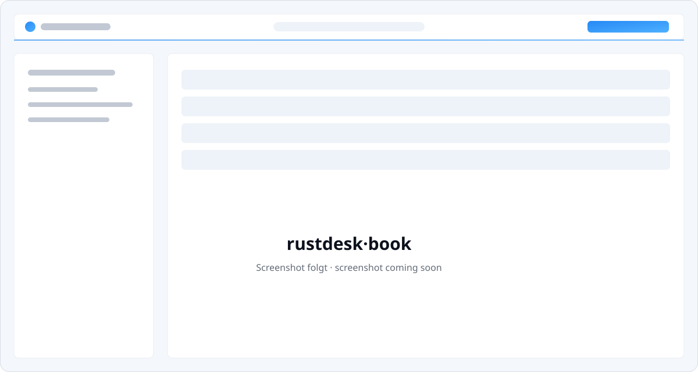

# rustdesk-book

Ein selbstgehostetes Adressbuch für [RustDesk](https://rustdesk.com). Es hält
Geräte, Zugangsdaten und Kundenzuordnung an einem Ort – und öffnet die
Fernwartung per Klick. Gedacht für IT-Dienstleister und alle, die mehr als eine
Handvoll RustDesk-IDs pflegen.

Im Kern ist rustdesk-book ein Passwort-Tresor. Passwörter liegen ausschließlich
verschlüsselt in der Datenbank; Klartext gibt es nur auf ausdrückliche,
protokollierte Anfrage. Details dazu in [SECURITY.md](./SECURITY.md).



<!-- Platzhalter – echter Screenshot folgt. -->

## Funktionen

- Geräte mit RustDesk-ID, Alias, Kunde, Betriebssystem, Tags und Notizen
- Verbinden per Klick über `rustdesk://` – die URI wird serverseitig gebaut und
  das Passwort korrekt kodiert
- Passwörter AES-256-GCM-verschlüsselt; Anzeigen und Verbinden werden auditiert
- Verbindungs-Historie pro Gerät (wer hat wann verbunden/Passwort angezeigt)
- Kunden als eigene Entität: einmal umbenennen wirkt auf alle Geräte, mit
  Kontaktdaten und Notizen
- Persönliche Favoriten und private Geräte-Gruppen je Nutzer
- Optionaler Live-Status-Sync gegen einen eigenen RustDesk-Server (siehe
  `RUSTDESK_API_URL` in `.env.example`); ohne Server bleibt der Status manuell
- Drei Ansichten (Tabelle, nach Kunde gruppiert, Karten), Volltextsuche und
  Filter nach Status, OS, Kunde, Tag, Favoriten und Gruppe
- Import/Export als JSON (Export ohne Passwörter)
- RustDesk-OSS-Clients per Windows-, Linux- oder macOS-Skript ausrollen; einmalige oder permanente Enrollment-Tokens
- Einladungsbasierte Registrierung; erstes Konto wird zum Administrator
- Heller und dunkler Modus
- Optionaler, lesender MCP-Server: „Habe ich ein Gerät für Kunde X?“ direkt aus
  dem Assistenten beantworten

## Schnellstart mit Docker Compose

Vorausgesetzt sind Docker und Docker Compose.

```bash
# 1. Repository holen
git clone https://github.com/lucabmn/rustdesk-book.git
cd rustdesk-book

# 2. Umgebung anlegen
cp .env.example .env
```

Trage in `.env` die nötigen Werte ein und **erzeuge eigene Schlüssel**:

```bash
# 32-Byte-Schlüssel für die Passwortverschlüsselung (Pflicht)
openssl rand -base64 32

# Session-Secret für better-auth
openssl rand -base64 32

# optionaler Bearer-Token für den MCP-Endpunkt
openssl rand -hex 32
```

Minimal benötigte Variablen in `.env`:

```dotenv
POSTGRES_PASSWORD=…            # frei wählbar
BETTER_AUTH_SECRET=…           # openssl rand -base64 32
APP_ENCRYPTION_KEY=…           # openssl rand -base64 32  (getrennt sichern!)
BETTER_AUTH_URL=https://adressbuch.example.com
# MCP_API_KEY=…                # nur setzen, wenn der MCP-Server genutzt wird
```

Dann starten:

```bash
docker compose up -d
```

Die App läuft auf Port 3000. Migrationen werden beim Start automatisch angewandt.
Beim ersten Aufruf legst du das Administrator-Konto an – danach ist die
Registrierung nur noch per Einladung möglich.

Das Container-Image wird bei jedem Release nach
`ghcr.io/lucabmn/rustdesk-book` veröffentlicht (multi-arch, amd64/arm64).

## Konfiguration

| Variable             | Pflicht | Beschreibung                                                                 |
| -------------------- | :-----: | ---------------------------------------------------------------------------- |
| `DATABASE_URL`       |   ja    | PostgreSQL-Verbindung. In Compose automatisch gesetzt.                        |
| `APP_ENCRYPTION_KEY` |   ja    | 32-Byte-Schlüssel (base64/hex) für die Passwortverschlüsselung.              |
| `BETTER_AUTH_SECRET` |   ja    | Secret zum Signieren der Sessions. Muss sich vom Verschlüsselungsschlüssel unterscheiden. |
| `BETTER_AUTH_URL`    |   ja    | Öffentliche Basis-URL der Instanz.                                           |
| `MCP_API_KEY`        |  nein   | Bearer-Token für `/mcp`. Ohne diesen ist der MCP-Endpunkt deaktiviert.        |
| `TRUST_PROXY_HEADERS` | nein   | `true` vertraut Proxy-IP-Headern für Enrollment-Rate-Limits; nur hinter einem vertrauenswürdigen Reverse Proxy aktivieren. |

> **Wichtig:** Geht `APP_ENCRYPTION_KEY` verloren, sind alle gespeicherten
> Passwörter unwiederbringlich verloren. Sichere ihn getrennt von der Datenbank.

## MCP-Server

rustdesk-book stellt optional einen [Model-Context-Protocol](https://modelcontextprotocol.io)-Server
unter `/mcp` bereit. Er ist lesend und gibt keine Passwörter aus. Zugriff nur mit
`Authorization: Bearer <MCP_API_KEY>`.

Verfügbare Tools:

- `search_devices` – Volltextsuche über ID, Alias, Kunde, Tags, Notizen
- `list_devices` – Liste, optional nach Kunde, OS, Status oder Tag gefiltert
- `get_device` – ein Gerät per RustDesk-ID oder Alias
- `list_customers` – alle Kunden mit Gerätezahl

Damit lassen sich Fragen wie „Habe ich ein Gerät für die Bäckerei Krause?“ oder
„Welche Server sind offline?“ direkt aus einem Assistenten beantworten.

## Entwicklung

Voraussetzungen: Node 22, pnpm, PostgreSQL.

```bash
pnpm install
cp .env.example .env.local        # Werte eintragen, Schlüssel erzeugen
pnpm db:migrate
pnpm dev                          # http://localhost:3000
```

Weitere Hinweise in [CONTRIBUTING.md](./CONTRIBUTING.md).

## Technik

TanStack Start (React, SSR) · oRPC · Drizzle ORM · PostgreSQL · better-auth ·
Paraglide (i18n) · Vite. Das UI basiert auf dem Tenvima Design System.

## Lizenz

[MIT](./LICENSE)
